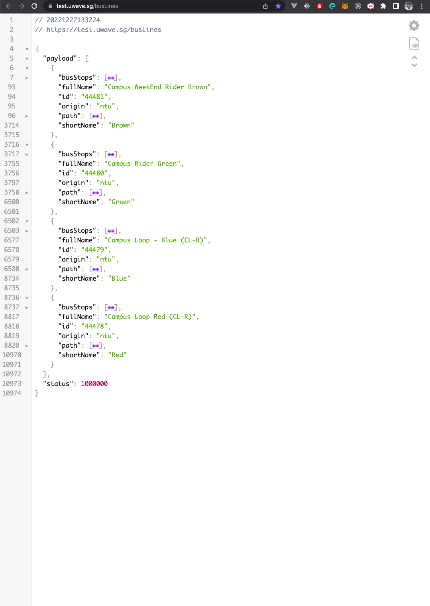
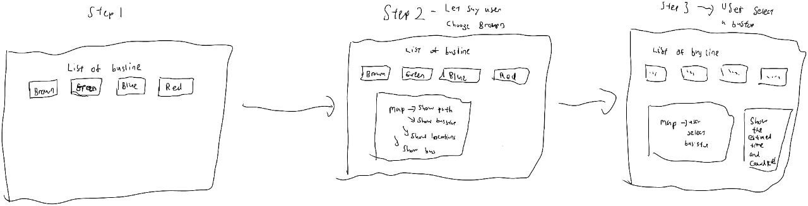

# uWave-Challenge

# Task 1

1. Explore the data from the external API provider
- You should try to make sense of the values of each field (but you do not have to
explicitly state out the meaning of each field as this step is just for your own
understanding of the data)

- You can include the scripts that you used in exploring the data to show your thought
process.

- You can show any insights you have found based on exploring and understanding
the data given.

- You can choose to skip this task as well, as this is just preparatory work for
subsequent tasks.

# Answer

## API: https://test.uwave.sg/busLines
---
### Description

This API uses the GET method and it gives the user the following data

1. 4 types of busline and they are Campus Weekend Rider Brown, Campus Rider Green, Campus Loop - Blue, Campus Loop Red.
2. Each busLines have an ID
3. Each busLines will also give a path where the bus will go.
4. Each busline also have a shortName which are Brown, Green, Blue and Red.
5. Each busline will also have a set of busStops that they will stop.

# Overall payload: 




## API: "https://test.uwave.sg/busPositions/" + busLineId
---
### Description

This API uses the GET method and it gives the user the following data

1. Bearing of the bus position
2. The Crowd Level of the Bus
3. Latitude and Longitude coordinates of the bus
4. The vehicalePlate of the bus
5. The number of bus avaliable for that busline

# Example: Campus Loop Red buses position payload

```
// 20221227163446
// https://test.uwave.sg/busPositions/44478

{
  "payload": [
    {
      "bearing": 96,
      "crowdLevel": "crowd",
      "lat": 1.339872,
      "lng": 103.681278,
      "vehiclePlate": "PD678J"
    },
    {
      "bearing": 343.9,
      "crowdLevel": "low",
      "lat": 1.355927,
      "lng": 103.6876,
      "vehiclePlate": "PC2840Z"
    },
    {
      "bearing": 273,
      "crowdLevel": "low",
      "lat": 1.33938,
      "lng": 103.67976,
      "vehiclePlate": "PD648X"
    }
  ],
  "status": 1000000
}
```
---

# Task 2

2. Plan a bus-timing backend service with the required endpoints

Your endpoint(s) should provide the following information:
1. Relevant information of the bus stops and bus lines
2. Locations of the running buses in the requested bus line
3. Estimated arrival time/duration of the incoming buses at the requested bus stop*

Do note that:
- You have the freedom to define the requests and responses for your own endpoints.
- You should explain sufficiently for each of your design decisions.
- You can add additional features e.g. storage/caching, if you deem it necessary.
- *For the estimation of arrival time/duration, you need to explain clearly your method
to estimate the values, as well as the pros and cons of using the method to estimate
the arrival time.
---
# Answer

From a product perspective, with the above details i can create the following features for my users.

1. The types of buslines that NTU have.
2. The stops that each buslines support.
3. The path that each buslines the buses uses.
4. The location of the bus in the requested busline
5. The crowd level of the bus in each busline.

## Product flow

Assuming this is the product flow:

user able to see the list of busline avaliable -> user select a particulater busline -> user is able to see the paths, bus stops, crowd level and the locations of the buses
->user is able to select the bus stop -> user is able to see the list of bus arrival time



## API needed in each step

Steps  | API needed | Descriptions
------------- | ------------- | -------------
Step 1  | /bus-lines | This should return a list of avaliable bus-lines. Asssuming that there might be a chance that a new busline might be created, this api is needed
Step 2 | /bus-lines/{busLineId} | This should return full route information, bus stops and location of buses and crowd level
Step 3 | /bus-line/bus-stop/{busStopId}/time | This should calculate the bus arrival time, then return the arrival time of each bus
---
## GET /bus-lines

Value | Type | Example
------------- | ------------- | -------------
busLineId  | string | "busline-Id": "44481"
busLineName  | string | "busLineName": "Campus WeekEnd Rider Brown"
busLineShortName | string | "busLineShortName": "Brown"

## Sample response
```
{
	  "busline-Id": "44481",
    "busLineName": "Campus WeekEnd Rider Brown",
    "busLineShortName": "Brown"
}
```
---

## GET /bus-lines/{busLineId}

Value | Type | Example
------------- | ------------- | -------------
busStops  | Array | "busStops": [{busStopDetails}]
{busStopDetails}| "Id": string,<br/> "lat": float64,<br/> "lng":float64,<br/> "busStopName": string |   {<br/>"Id": "377906",<br/>"lat": 1.33781,<br/>"lng": 103.69739,<br/>"busStopName": "Pioneer MRT Station Exit B at Blk 649A"<br/>}
busPaths | Array | "busPaths": [{coordinates}]
coordinates | "lat": float64,<br/> "lng":float64<br/>| {<br/>"lat": 1.33771, "lng": 103.69735<br/>}
busLocations | Array | "busLocations":[{busDetails}]
busDetails | "bearing": float64, <br/> "lat": float64,<br/> "lng":float64,<br/> "crowdLevel": string, <br/>"vehiclePlate": string | {<br/>"bearing": 96,<br/>"crowdLevel": "crowd",<br/>"lat": 1.339872,<br/>"lng": 103.681278,<br/>"vehiclePlate": "PD678J"<br/>}
}

## Sample response
```
{
	"busStops": [  
        {
          "Id": "377906",
          "lat": 1.33781,
          "lng": 103.69739,
          "busStopName": "Pioneer MRT Station Exit B at Blk 649A"
        },
        {
          "id": "378233",
          "lat": 1.34564,
          "lng": 103.6878,
          "busStopName": "Hall 1 (Blk 18)"
        },
        {
          "id": "378237",
          "lat": 1.34882,
          "lng": 103.68558,
          "busStopName": "Canteen 2"
        }
    ],
    "busPaths":[
        {  
          "lat": 1.33771,
          "lng": 103.69735
        },
        {
          "lat": 1.33771,
          "lng": 103.69744
        },
        {
          "lat":  1.33771,
          "lng": 103.69753
        }
    ],
    busLocations:[
        {
        "bearing": 96,
        "crowdLevel": "crowd",
        "lat": 1.339872,
        "lng": 103.681278,
        "vehiclePlate": "PD678J"
        },
        {
        "bearing": 343.9,
        "crowdLevel": "low",
        "lat": 1.355927,
        "lng": 103.6876,
        "vehiclePlate": "PC2840Z"
        },
        {
        "bearing": 273,
        "crowdLevel": "low",
        "lat": 1.33938,
        "lng": 103.67976,
        "vehiclePlate": "PD648X"
        }
    ]
}
```
---
## GET /bus-line/bus-stop/{busStopId}/time

Value | Type | Example
------------- | ------------- | -------------
busArrivalDetails  | Array | "busArrivalDetails": [{busDetails}]
busDetails  | "arrivalTime": Duration, "vehiclePlate": string | {"arrivalTime": 10mins, "vehiclePlate": "PD648X"}

## Sample response
```
{
	busArrivalDetails: [
        {
            "arrivalTime": 10mins, 
            "vehiclePlate": "PD678J"
        },
        {
            "arrivalTime": 20mins, 
            "vehiclePlate": "PC2840Z"
        }
        ,
        {
            "arrivalTime": 30mins, 
            "vehiclePlate": "PD648X"
        }
    ]
}
```
# Reasons
I build this system assuming that the client flow is how i draw on the diagram above. Most likely, i would have 3 data models.

1st one data model would be called busline where i would store the busLineId, busLineName and busLineShortName. Assuming that the buslines won't change, I will seed the data by calling the external API.
2nd model would be called busLineDetails. This model will contain the busStops, busPath, busLocations and busDetails. Assuming that the busStops, busPaths won't change, i will seed the data for this 2 whereas for busLocations and busDetails, i will have to be dependent on the external API.
3rd model would be called busArrivalDetails. This model will contain arrivalTime and vehiclePlate. Calculation will be done in this API. 

## GET: /bus-lines

When the user landed on the landing page, user will see a list of bus-lines buttons. In order to get this list of bus-lines, the follow API is designed:

- **/bus-lines** will give the client a list of bus lines that are avaliable. This API will query the database for the latest buslines routes.

## pros:

- Simple and straight forward, allow frontend engineers to get the list of avaliable busline
- Does not rely on external API too much. Much more stability

## cons:

- The above is assuming that the busLines wouldn't change. Let say if the busLines changes or there is an additional busLines, i would have to call the external API and seed the data again.
---
## GET: /bus-lines/{busLineId}

After user see the list of buslines, user will click on the button, by clicking on the button, client will call the following API:

- **/bus-lines/{busLineId}** client will have to send the busLine Id in the GET request URL. From there, we will query our db for the bus path, bus stops. In this API, we will also call 
https://test.uwave.sg/busPositions/" + busLineId to get the details such as locations and plate of the bus avaliable for that bus line. We will return the client the busPath, bus location and location of bus Stops. FrontEnd Enginners can use these details and map the location and bus path on a map.

## pros:
- By combing these details into 1 API, i am reducing the number of endpoints that client needs to call.

## cons:
- This API is very dependent on the external API to get the actual location and details of the bus.
- The response might be too large which will affect the performance of the API.

---

## GET: /bus-line/{busLineId}/bus-stop/{busStopId}/time

After user see the locations of bus, bus stops and routes. User is able to select the bus stop for the line that he chose. After that, this API would be called.

- **/bus-line/bus-stop/{busStopId}/time** client will have to send the busStop Id in the GET request URL. From there, we will query our db for the location of the bus stop. In this API, we will also call 
https://test.uwave.sg/busPositions/" + busLineId to get the details such as locations and plate of the bus avaliable for that bus line. Then, we will calculate the arrival time and return the client and vehiclePlate

## cons:
- This API is very dependent on the external API to get the actual location and details of the bus.


## POST: /seed-bus-lines

This API will only be called when we know that there is a new busLine. Assuming that there will only be adittional bus Routes, when this API is called, they will delete the previous records and create the new set of busLines. This API also can be called if the DB does not contain any busLines.
